# Notater for gruppe 2 - IMRT100

*Denne siden er notater tatt for Gruppe 2 i IMRT100 høsten 2024*

## Innholdsfortegnelse

- [Tegne et kart](#tegne-et-kart)
- [Georeferere karttegningen inn i QDIS](#georeferere-karttegningen-inn-i-qdis)
  - [Resultater](#resultater)
- [Måle høyden på tuntreet](#måle-høyden-på-tuntreet)
  - [Totalstasjon](#totalstasjon)
    - [Teori](#teori)
  - [CloudCompare](#cloudcompare)
    - [Fremgangsmåte](#fremgangsmåte)
    - [Måle høyde med histogram](#måle-høyde-med-histogram)
    - [Måle høyden mellom to punkter](#måle-høyden-mellom-to-punkter)
    - [Usikkerhetsmomenter](#usikkerhetsmomenter)
    - [Tanker](#tanker)
- [3D-scanning](#3d-scanning)
  - [Oppsett i Blender](#oppsett-i-blender)
  - [Klasserom scan](#klasserom-scan)

## Tegne et kart

Vi valgte å tegne kart over bygningen Cirkus.

I mangel på bedre alternativ, så valgte vi å skritte opp bygningen. 
Vi lagde først noen grove skisser.  Etter dette satt vis oss i bikuben, og tegnet opp.

Vi brukte også: "https://www.norgeibilder.no/", for å få et fugleperspektiv når vi tegnet kartet. Samt så hjalp denne siden oss med mål når skrittlengden ikke passet. 
For eksempel ved plenene på framsiden. 

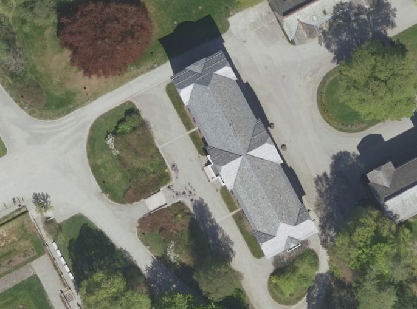

Fra dette så lagde vi følgende tegning:

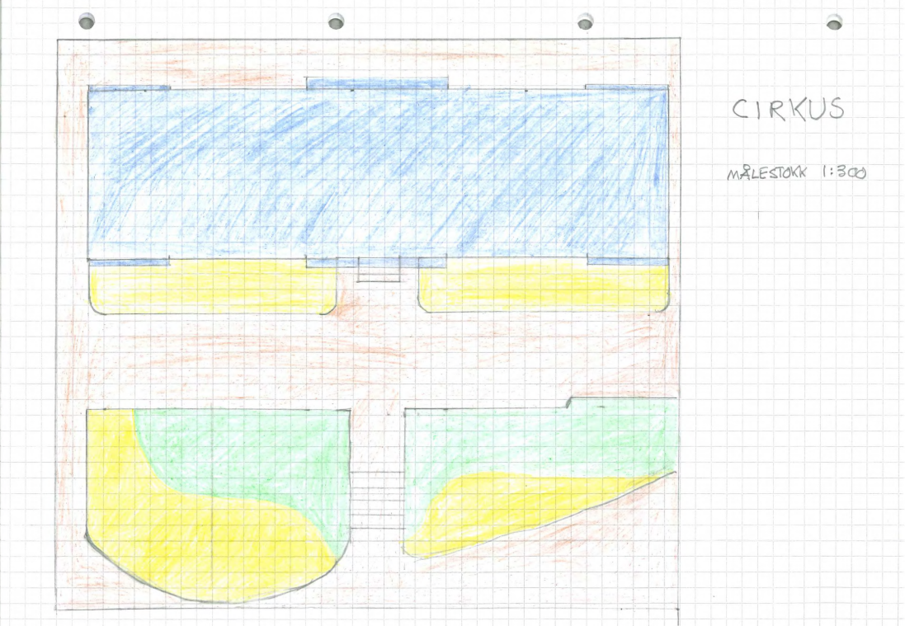

## Georeferere karttegningen inn i QDIS

Vi skal georeferere kartet vi tegnet på dag 1 inn i QDIS. Dagen startet med å fullføre kartegningen fra gårsdagen, og å få scannet den inn. 

Samtidig så installerte gruppen QGIS på maskinene, og vi lastet ned en malfil forberedt til dette faget. 

Går så inn under Layer -> georeferencing

Der velger vi fire punkter (hjørnene på byningen).

**Viktig!** Endre transformation settings -> transfrormation type fra lineær til prosjektiv

### Resultater

Først så sammenlinker vi med det topografiske kartet fra mal-filen:

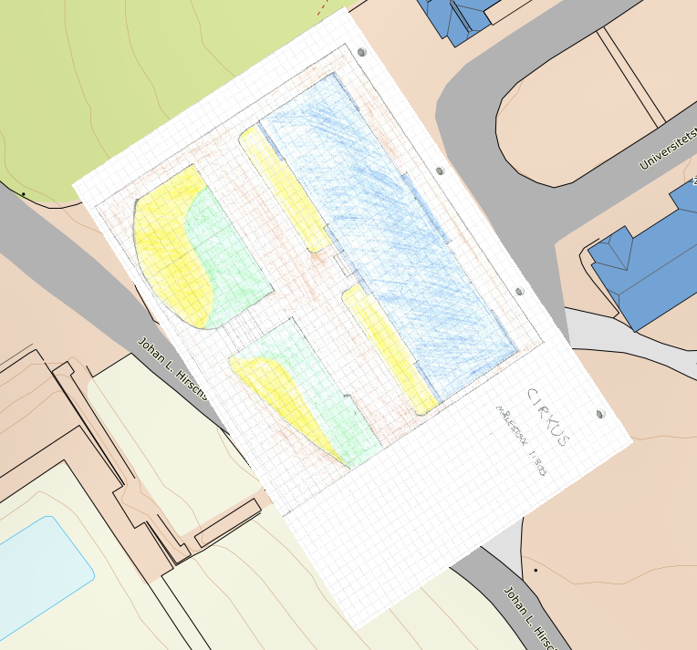

Så sammenlikner vi det med flyfoto:

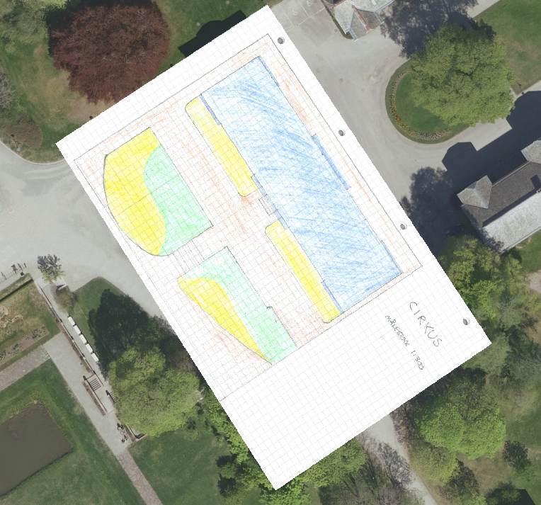

Ser at de stemmer høvelig godt overrens med virkligheten

## Måle høyden på tuntreet

På dag en skulle vi annslå høyden på tuntreet. Visse personer på gruppa hevdet at det kunne være opp mot 50 m høyt. Mens andre var mer konservative og gjettet lavere.

### Totalstasjon

#### Teori

Vi bruker først trigonometri til å finne ut hva vi må måle for å finne høyden på tuntreet. Vi finner ut at vi trenger å måle vinkelen ned til bunn $\theta_1$, og vinkelen opp til toppen av treet $\theta_2$. Så skal det brukes et prisme for å finne avstanden til treet fra målestasjonen, så da måler vi avstanden $x$, som illustrert under.

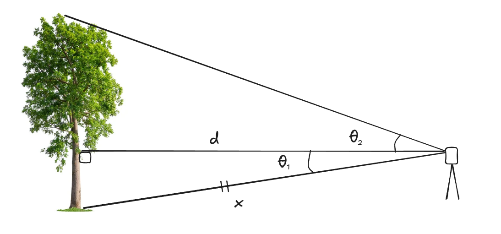

Finner så at $d$ er gitt ved:

$$x \cos \theta_{1} = d$$

Vi har to rettvinklede trekanter, så gitt ved trigonometriske identiteter har vi att høyden på treet vil være gitt ved:

$$x \sin{\theta_{1}}+ x \cos{\theta_{1}}\tan{\theta_{2}}= h$$

Dette kan faktoriseres til:

$$x \left( \sin(\theta_{1}) + (\cos(\theta_{1}) \tan(\theta_{2}) \right) = h$$

Vi testet formelen ved å måle tavla i landmålerommet.

| Mål        | Verd           |
| ---------- | -------------- |
| $\theta_1$ | $11,58\ [gon]$ |
| $\theta_2$ | $8.97\ [gon]$  |
| $x$        | $3,57\ [m]$    |

Ved å bruke formelen over, så fant gruppen at tavla var $1.15\ m$ høy. Vi kontrollerte dette med å bruke en tommestokk for å sjekke fasiten. Tavla ble målt til $1,2\ m$ som gir oss et avvik på 5 cm. 

For å sjekke at det ikke var noe uhumskheter i matten kontrollerte vi med å måle høyden på Odin i gruppa.....

Vi målte også høyden på Odin som hevdet han var 190 cm

$$6.04\ [m] \cdot  \left( \sin(15.5\ [gon])\ +\ \tan(4.5\ [gon]) \right)\ =\ 1.87\ [m]  $$
Dette er 3 cm under den forventede høyden, men kan forklares med at prismet stikker litt opp fra bakken. Vi kunne gått mer i detalj på usikkerheter, da måtte vi har vist usikkerheten på totalstasjonen, samt så må en ta høyde for presisjonen til personen som sikter inn totalstasjonen ved målingen av vinklene. 

En usikkerhet ved å måle treet på denne måten, er at trær ikke nødvendigvis vokser rett opp av bakken. De har en tendens til å strekke seg mot sollys. Dermed blir det å betrakte det som en rett strek i et par rettvinklede trekanter hyggelig i teorien, men ikke nødvendig like snilt i praksis. 

For å motvirke dette burde vi ta flere målinger, fra flere forskjellige vinkler, for å oppnå best mulig resultat. Samtidig så er alt dette før vi tar blader og greiner med i beregningen, så det er en del usikkerhetsmomenter ute å går her.

### CloudCompare

Når vi så skal måle høyden på Tuntreet med CloudCompare

#### Fremgangsmåte

1. Laster først inn begge filene inn i CloudCompare.
2. Bruker så kryssegmenteringsverktøyet for å lage et utsnitt av tuntreet. Får da 2 segmenterte filer.
3. Kloner disse filene.
4. Merger klonen for å få en punksky.
5. Ønsker å få høydeverdier, går derfor inn i tools -> projection -> Export coordinates to SF (velder default z-verdier).
6. Justerer så litt på display ranges i properties boksen for å få det seende ok ut.

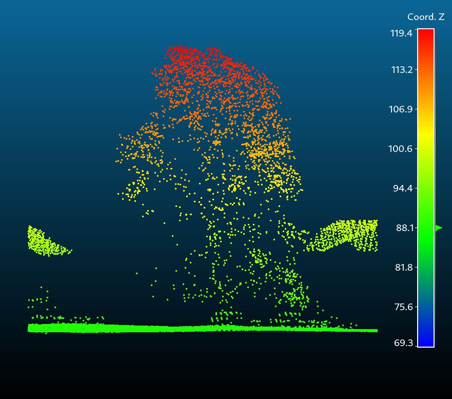

#### Måle høyde med histogram

I tillegg til denne kan det være nyttig å legge ved et histogram:

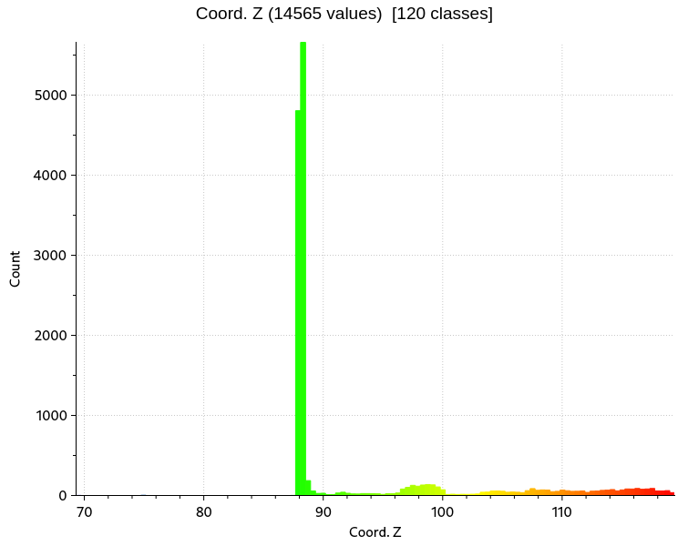

Ser her at det er ganske flatt, og de fleste bakke-verdiene ligger rundt $88\ m$. Vi ser at de høyeste punktene i denne punkskyen ligger på $119.4\ m$. Finner dermed differansen som her tilsvarer høyden på Tuntreet som er $31,4\ m$.

#### Måle høyden mellom to punkter

Man kan også måle mellom to punkter i punktskyen, med sine ulemper. 

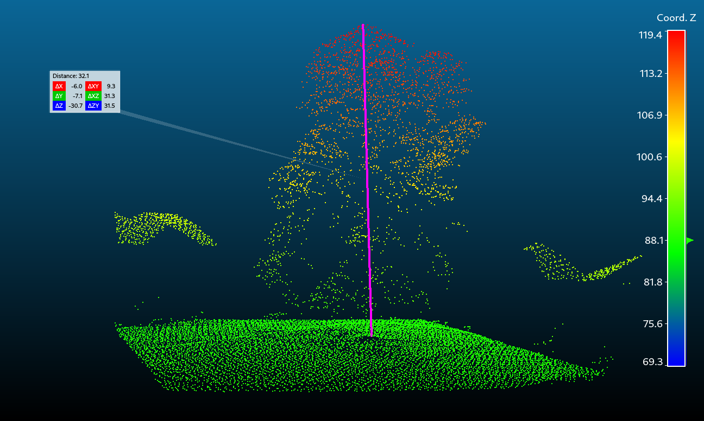

#### Usikkerhetsmomenter

Vi har ikke metadata på bildefilen, og dermed er det vanskelig å vite når bildet er tatt. I og med at et tre vokser, så kan treet være høyere den dag i dag, enn når bildet blir tatt.

Utover dette så vil man ikke få målt treet rett ned til bunnen av stammen, pga at laseren allerede har blitt reflektert fra tretoppen. Dermed vil man få en trekant, så må man bruke trigonometri for å få det rett.

#### Tanker

- Tror det mest nøyaktige må være å bruke tre punkter, og vinklene mellom dem.
- Hvordan vet jeg at Z. cord er meter. Det er jo det... Må ligge i metadata eller noe fra LIDAR målingen.

Starter dagen med å laste ned Blender.

## 3D-scanning

Bruker så [PolyCam](https://poly.cam/) til å skanne en 3D modell av en kaffekopp. 

Logger så inn på polycam på pcn, og laster ned 3D modellen i filformatet GLTF ([Graphics Library Transmission Format](https://en.wikipedia.org/wiki/GlTF)). Selve filen blir faktisk lastet ned som en .glb fil.

Så importerer vi denne inn i blender.
### Oppsett i Blender

Laster opp filen, og enkelt og greit ser litt på den fra ulike vinkler. Rendre og får følgende resultat.

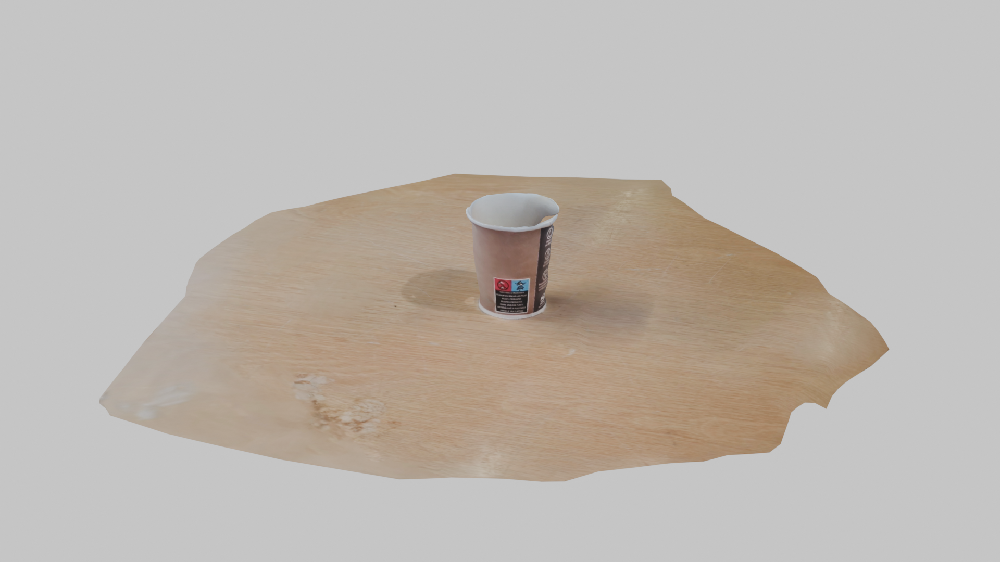

### Klasserom scan

Laster ned en .las fil, og åpner denne i CloudCompare

Under display -> Toggle Viewer Based Perspective

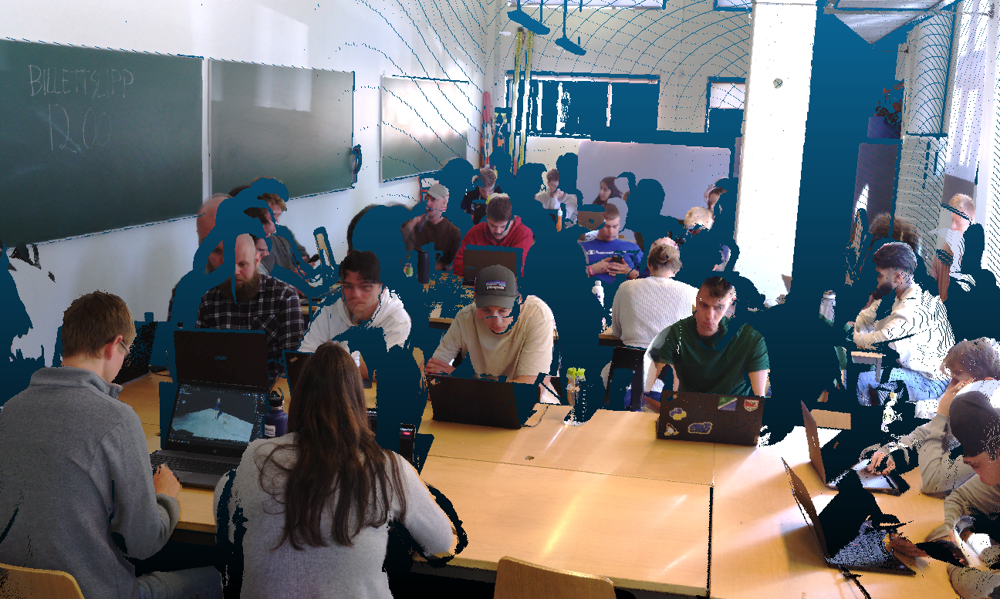

Ser fra bildet over, og under att laserscanningen blir forstyrret av at det er personer i bevegelse i klasserommet.

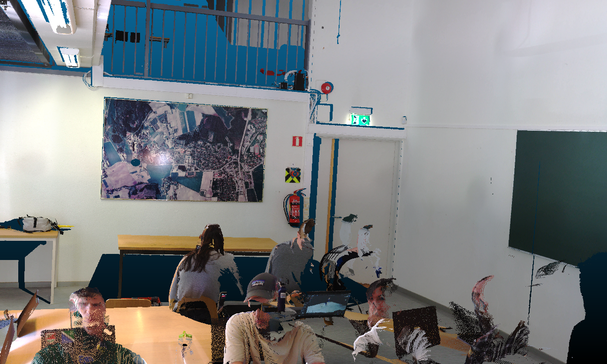

